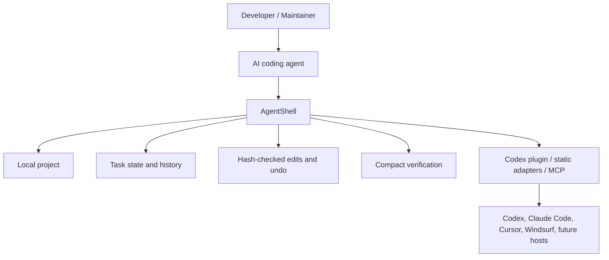
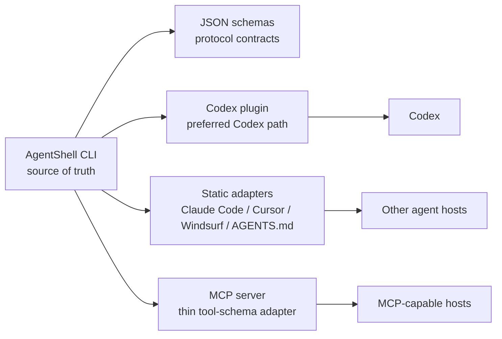

# AgentShell Product Positioning

本文档用于定位 AgentShell 作为 GitHub 项目的产品方向：它现在是什么、应如何讲清楚、如何避免闭门造车，以及下一步应该优先验证什么。

## AI OS 远景

长期看，AI coding agent 不会只需要一个更快的命令行工具。它们需要一个面向智能体的操作层：能理解项目状态、约束操作权限、压缩上下文、记录任务进展、恢复现场、验证结果，并把高风险动作变成可预览、可回滚、可审计的步骤。

AgentShell 可以成为这个 AI OS 的一个早期内核，而不是一开始就宣称自己是完整系统。



AI OS 的核心不是“替用户做一切”，而是让 agent 在真实工程环境中更稳：

- 少读噪音，多读结构化事实。
- 少猜测下一步，多返回可执行的 next action。
- 少把终端日志塞进上下文，多用摘要、引用和按需展开。
- 少做不可审计的修改，多用 hash、preview、undo 和 schema。
- 少绑定单个 agent 产品，多用 CLI、plugin、adapter、MCP 形成可迁移接口。

## AgentShell 当前位置

AgentShell 现在最准确的定位是：

> A structured local CLI for AI coding agents that makes code understanding, test diagnosis, safe edits, and verification cheaper, faster, and more auditable.

它不是通用 shell 替代品，也不是完整 IDE，更不是独立 coding agent。它是 agent 调用本地工程能力时的结构化执行层。

当前最强的产品楔子是失败测试修复循环：

1. `understand` 给出项目概况。
2. `verify test` 把嘈杂测试输出压缩成结构化摘要。
3. `diagnose test --compact` 聚合失败、相关文件、候选修复计划和下一步建议。
4. `fix test --fast --compact` 走一条更短的诊断、建议、应用、验证路径。
5. `change suggest`、`change fill`、`change` 用预览和 hash 约束修改。
6. `run next`、`run status --compact` 帮 agent 维持任务状态。
7. `metrics --compact` 和 benchmark 证明 token 与命令往返的收益。

因此 GitHub 首页叙事应该避免过早喊“AI OS”，而应采用双层表达：

- 近期产品：structured CLI for AI coding agents。
- 长期方向：the local execution layer of an AI-native development OS。

## 与 CLI、MCP、Plugin 的关系

AgentShell 的架构叙事应保持一个清晰原则：CLI 是事实源，其他形态是分发和适配层。



| Layer | Product role | Positioning rule |
|---|---|---|
| CLI | Canonical runtime and protocol source | Owns commands, JSON output, schemas, state, file safety, verification, metrics. |
| Codex plugin | Best current Codex distribution path | Teaches Codex when to call AgentShell and ships the CLI payload. |
| Static adapters | Cross-host adoption bridge | Give other agents host-specific instructions without creating a second runtime. |
| MCP | Future/optional structured host interface | Should stay thin, CLI-backed, schema-aligned, and limited to stable high-value tools. |

MCP should not become a parallel product too early. A large MCP server is useful only after the CLI contract is stable enough that tool schemas expose durable behavior instead of freezing experimental design. Until then, MCP is best treated as an adapter around the CLI.

Plugin should be marketed as “the easiest way to make Codex use AgentShell,” not as the core product. The core product is the local structured execution layer.

## MrBeast / Elon / Jobs 视角建议

这些视角不是人格崇拜，而是三种产品压力测试：传播、野心、品味。

### MrBeast 视角：让价值在 10 秒内可见

GitHub README 的第一屏需要一个强对比 demo：

- Before: agent dumps raw `npm test` logs, reads broad files, loops manually.
- After: `agentshell fix test --fast --compact` returns diagnosis, safe suggestion, verification, next action.

建议做一个可复制的 mini benchmark：

```bash
npm run benchmark:suite
agentshell fix test --fast --compact
agentshell metrics --compact
```

README 不要只说“token efficient”。要展示数字、截图或 JSON 摘要片段，例如 command count、output chars、estimated tokens、pass/fail state。传播点应是：

> Your coding agent is wasting context on terminal noise. AgentShell turns the loop into structured JSON.

### Elon 视角：押注最大方向，但用工程里程碑拆解

如果目标是 AI OS，不要从“平台化”开始。先把一个闭环做到极致：

- Local project understanding.
- Test diagnosis.
- Safe patching.
- Verification.
- Task memory.
- Undo and audit trail.

外部叙事可以更大胆：

> Today: a CLI that makes agents better at fixing failing tests.
> Next: the execution substrate for AI-native software work.

但内部路线要坚持每一步都能被 benchmark、schema 和真实项目验证。野心负责方向，指标负责刹车。

### Jobs 视角：少即是多，产品边界要漂亮

AgentShell 的危险不是能力太少，而是把所有 agent 工具都塞进来。应坚持三条品味原则：

- 每个命令都应该返回 agent 可以直接决策的结构化结果。
- 每个修改能力都应该有 preview、hash、undo 或明确的安全边界。
- 每个新接口都应该减少 agent 的认知负担，而不是让 agent 学会更多内部细节。

产品语言也应更锋利：

- 不说 “a collection of utilities”。
- 少说 “wrapper around shell commands”。
- 多说 “structured execution layer for AI coding agents”。
- 多强调 “compact, auditable, reversible local workflows”。

## 避免闭门造车的外部验证清单

AgentShell 应把外部验证作为产品开发节奏的一部分，而不是发布前补材料。

### 用户与场景验证

- 找 10 个真实 agent-heavy 开发者，让他们在自己的项目中用 AgentShell 跑一个失败测试修复任务。
- 分别覆盖 solo maintainer、小团队、开源维护者、AI coding power user、agent tool builder。
- 记录他们当前不用 AgentShell 时的真实流程：终端输出、文件读取、复制粘贴、回滚方式、失败点。
- 验证他们是否愿意在 AGENTS.md、Claude Code、Codex、Cursor 或 Windsurf 指令里加入 AgentShell。

### 项目与数据验证

- 维护一个真实项目 evaluation queue，不只用玩具 demo。
- 每个 fixture 记录语言、测试框架、失败类型、raw output size、AgentShell output size、修复成功率。
- 把成功案例和失败案例都写入 release notes，尤其是 unsupportedReason。
- 追踪 first useful response time，而不仅是最终测试是否通过。

### 分发验证

- 验证 `npm link`、Codex plugin、本地 plugin cache、static adapter、MCP skeleton 的安装摩擦。
- 让新用户从 README 独立完成安装和第一次 demo，记录卡点。
- 检查不同 host 是否真的遵守“先用 AgentShell 再读 raw logs”的指令。
- 对比 shell-only prompt、static adapter、Codex plugin、MCP tool schema 四种路径的使用成功率。

### 信息架构验证

- README 第一屏是否让用户知道 AgentShell 解决什么问题。
- 命令列表是否按工作流组织，而不是按实现顺序堆叠。
- 是否能在 30 秒内解释 CLI、plugin、adapter、MCP 的关系。
- 是否有一条不需要理解内部架构也能跑通的 demo path。

### 商业与生态验证

- 观察哪些用户只想要本地开源 CLI，哪些用户需要团队策略、审计、集中指标或托管服务。
- 访谈 agent host/tooling 团队，确认他们是否愿意通过 CLI、plugin 或 MCP 接 AgentShell。
- 确认开源边界：核心 CLI 开源，团队治理、跨仓库指标或托管 dashboard 可能是未来商业层。
- 收集 GitHub issue 标签：install friction、unsupported test runner、unsafe suggestion、adapter confusion、docs confusion。

## 下一步路线

### 0-2 周：把 GitHub 项目说清楚

- 重写 README 第一屏：一句定位、一个 60 秒 demo、一个 before/after 数字对比。
- 在 README 中链接本文件，并把 CLI/plugin/MCP 关系图压缩成短段落。
- 增加 “Who this is for / not for”：
  - For: people using AI coding agents on real local repos.
  - Not for: replacing terminals, IDEs, or human review.
- 把 `fix test --fast --compact` demo 做成最短 happy path。

### 2-4 周：验证失败测试修复楔子

- 扩展 benchmark suite，覆盖更多真实失败类型。
- 将 unsupported cases 明确产品化：返回原因、下一步、缺失能力。
- 做 5-10 个外部项目 dry-run 报告，只收集数据，不急于自动修改。
- 发布一篇 “raw terminal output vs structured agent execution” 的技术说明。

### 1-2 个月：稳定协议与分发

- 固化核心 JSON schema 和 protocol versioning 的兼容承诺。
- 保持 MCP thin adapter，不扩张为第二运行时。
- 强化 Codex plugin smoke path 和 adapter package 生成流程。
- 为 Claude Code、Cursor/Windsurf、AGENTS.md 各提供一个真实项目示例。

### 2-3 个月：从工具走向工作层

- 强化 task run graph：把 diagnose、change、verify、metrics 变成可解释的工作记录。
- 增强 rollback/audit story，让用户信任 agent 可以试错。
- 增加跨任务指标：节省 token、减少命令数、减少 raw log 展开次数、修复成功率。
- 探索团队场景：共享 adapter policy、allowed commands、audit export。

### 长期：AI-native development OS 的本地内核

- 继续以 CLI 为内核，plugin/MCP/adapters 为壳。
- 把 agent 的本地开发循环抽象为 discover、plan、change、verify、remember、undo。
- 当外部 host 需求足够明确时，再扩展 MCP 和更深集成。
- 避免平台幻觉：每个 AI OS 组件都必须先在真实工程任务里证明能省时间、省上下文或降低风险。

## 当前建议摘要

AgentShell 现在最应该赢的不是“平台故事”，而是“让 agent 修一个失败测试更快、更便宜、更安全”。只要这个楔子足够强，AI OS 远景就会自然可信；如果楔子不强，远景会变成口号。

因此近期产品判断可以压缩成一句话：

> Make the local coding-agent loop structured, compact, auditable, and reversible, starting with failing-test repair.
